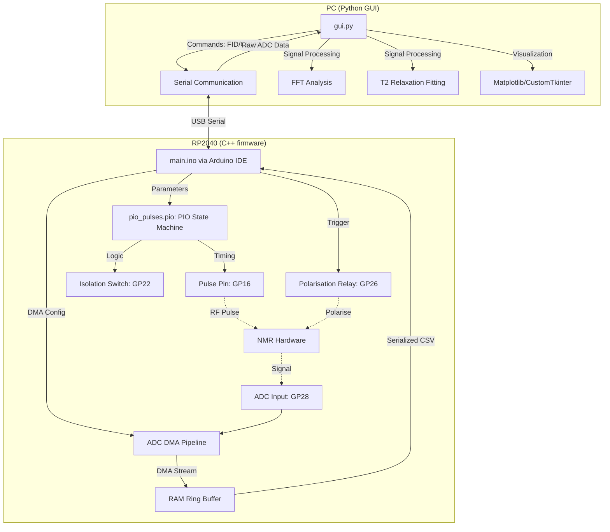

# C++ based NMR Spectrometer Control Firmware

A high-precision controller for my Earth's Field Nuclear Magnetic Resonance (EFNMR) spectroscopy Master's Research Project, built on the Raspberry Pi Pico (RP2040). This project integrates bare-metal C++ firmware with a modern Python desktop application for scientific data analysis.


---

## Contents

- [Features](#features)
- [Technical Architecture](#technical-architecture)
- [Tech Stack](#tech-stack)
- [Key Engineering Decisions](#key-engineering-decisions)
- [System Gallery](#system-gallery)
- [Installation & Usage](#installation--usage)
- [License](#license)

---

## Features

- **Cycle-Accurate Pulse Generation**: Sub-microsecond timing for B1 field pulses using the RP2040 PIO subsystem.
- **Gapless Data Acquisition**: High-speed ADC streaming (up to 500 kS/s) via DMA with zero CPU overhead.
- **Real-Time Signal Processing**:
    - **T2 Relaxation Fit**: Automated mono-exponential fitting for CPMG echo trains.
    - **FFT Spectrum**: Frequency domain analysis with Hanning windowing and peak detection.
- **Modern Desktop UI**: Responsive dark-mode interface with multithreaded Serial communication.

---

## Technical Architecture

The system employs a command-response architecture over Serial, offloading timing-critical tasks to dedicated hardware peripherals.



### 1. PIO Pulse Engine
The `pio_pulses.pio` assembly handles the precise timing of the CPMG sequence. By using the PIO's independent state machines, the pulses remain jitter-free regardless of main CPU interrupts or serial I/O.

### 2. DMA ADC Transfer
To capture the rapidly decaying NMR signal without gaps, DMA channels transfer samples directly from the ADC FIFO to a memory buffer. This allows for continuous sampling at high rates while the CPU remains free to manage state transitions.

---

## Tech Stack

| Component | Technology | Role |
| :--- | :--- | :--- |
| **Firmware** | C++17 / Pico SDK | Hardware control and sequence management |
| **Logic** | PIO Assembly | Deterministic pulse timing |
| **Desktop UI** | Python / CustomTkinter | Modern experimental interface |
| **Analysis** | NumPy / SciPy | Exponential fitting and signal processing |
| **Visuals** | Matplotlib | Real-time waveform rendering |

---

## Key Engineering Decisions

| Decision | Logic |
| :--- | :--- |
| **PIO vs Bit-Banging** | Bit-banging introduced micro-jitter during CPMG sequences, reducing spin-echo precision. PIO provides cycle-accurate timing at 125MHz. |
| **CustomTkinter** | Chosen over standard Tkinter or PyQt to provide a modern, "premium" aesthetic while maintaining a lightweight footprint. |
| **DMA Integration** | Essential for gapless acquisition to ensure zero-loss data streaming. |

## Challenges and Lessons Learned
- **Hardware-level Logic**: The implementation of hardware-level logic (PIO and DMA) was the most significant technical hurdle. Configuring DMA registers and writing the `pio_pulses.pio` Assembly code (PIOASM) required a steep learning curve.
- **Lesson Learned**: Attempting to implement hardware-level features quickly without a deep conceptual understanding can lead to complex debugging cycles. In future iterations, more time would be allocated to the fundamental study of the RP2040 hardware manual before implementation to streamline the development process.

---

## System Gallery

### 1. Free Induction Decay (FID)
*Raw signal from the probe showing the decaying Larmor precession.*


### 2. Larmor Frequency Analysis
*FFT of the FID signal, accurately identifying the Larmor frequency near 2.2 kHz.*


### 3. CPMG Echo Train
*A train of spin echoes maintained by the PIO engine for T2 measurement.*


### 3. T2 Relaxation Fit
*Automated exponential fit of the echo amplitudes.*


### 4. Fourier Transform of the CPMG Echo Train
*Fast Fourier Transform (FFT) of the CPMG echo train, showing the NMR peaks.*


---

## Installation & Usage

### Prerequisites
- [Arduino IDE](https://www.arduino.cc/en/software)
- Python 3.9+
- [Raspberry Pi Pico (RP2040)](https://www.raspberrypi.com/documentation/microcontrollers/raspberry-pi-pico.html)

### Hardware Setup
1. Connect the spectrometer probe to **GP28 (ADC2)**.
2. Connect the pulse trigger to **GP16**.
3. (Optional) Connect the pre-polarisation coil control to **GP26**.

### Firmware Deployment
1. Open `main.ino` in the Arduino IDE.
2. Select **Raspberry Pi Pico** (or RP2040 Board).
3. Connect the Pico and click **Upload** (this flashes the firmware to the Pico)

### Desktop GUI Setup
Once the firmware is flashed to the Pico, the GUI can be used to control the NMR Spectrometer.
```bash
# Clone the repository
git clone https://github.com/sahmed0/spectrometer-cpp-firmware.git
cd spectrometer-cpp-firmware

# Install dependencies
pip install customtkinter pyserial numpy scipy matplotlib

# Run the application
python gui/gui.py
```

---

## License

Copyright (c) 2026 Sajid Ahmed. **All Rights Reserved.**

This repository is a **Proprietary Portfolio Project**.

While I am a strong supporter of Open Source Software, this specific codebase represents a significant personal investment of time and effort and is therefore provided for **recruitment evaluation only**.

* **Permitted:** Viewing, forking (within GitHub only), and local execution for review.
* **Prohibited:** Modification, redistribution, commercial use, and AI/LLM training.

For the full legal terms, please see the [LICENSE](./LICENSE) file.
